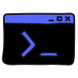
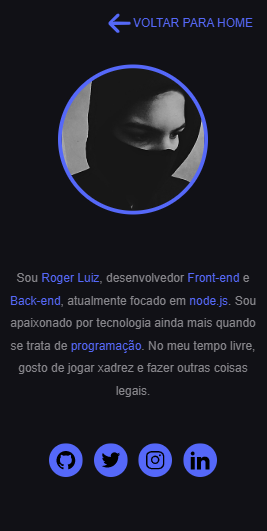

<h1 align="center">
  
</h1>

<p align="center">
  
</p>

<p style="width: 100%;" align="center">
  <h2>Desktop</h2>
    
</p>

<p style="width: 100%;" align="center">
  <h2>Mobile</h2>
    
</p>

## ⚙️ Requisítos

- [ ] [Node.js](https://nodejs.org/en/)
- [ ] [GIT](https://git-scm.com/)

## 🚀 Tecnologias

- [x] [Node.js](https://nodejs.org/en/)
- [x] [Express.js](https://expressjs.com/)
- [x] [Nodemon](https://nodemon.io/)
- [x] [dotenv](https://www.npmjs.com/package/dotenv)
- [x] [module-alias](https://www.npmjs.com/package/module-alias)


## 💻 Projeto

Essse projeto é uma aplicação web com o intuito de trazer um material sobre terminal linux com boa qualidade, com um front-end simples e um back-end com o node.js e o express.js.

## 🏁 Updates

Esse projeto está recebendo updates ( correções ortográficas, correção de bugs, melhorias no layout, refatorações no código fonte, atualização do conteúdo e etc ) constantemente.

## 🔖 Layout

Na criação do layout desse projeto foi usado Cascading Style Sheets ( css ) puro.

## 📂 Estrutura de diretórios

```
.github/
node_modules/
public/
  assets/
  images/
  pages/
  scripts/
  styles/
  index.html
src/
  config/
    index.js
  controller/
    index.js
  app.js
  routes.js
.env
.gitignore
LICENSE.md
package.json
package-lock.json
README.md
server.js    
```

## ⬇️ Instalação

- `git clone https://github.com/Rogerluiz0/starting-on-linux.git`;
- `cd starting-on-linux`;
- `npm install ou yarn install`;
- `npm start ou yarn start`.

## 🤔 Como contribuir

- Faça um fork desse repositório;
- Cria uma branch com a sua feature: `git checkout -b minha-feature`;
- Faça commit das suas alterações: `git commit -m 'feat: Minha nova feature'`;
- Faça push para a sua branch: `git push origin minha-feature`.

Depois que o merge da sua pull request for feito, você pode deletar a sua branch.

## :memo: Licença

Esse projeto está sob a licença MIT. Veja o arquivo [LICENSE](LICENSE.md) para mais detalhes.
